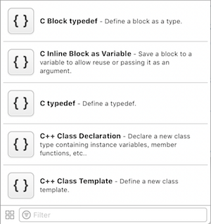
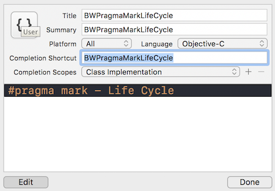
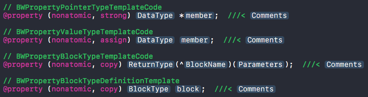
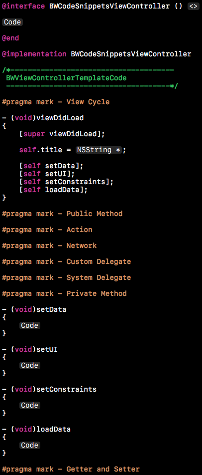
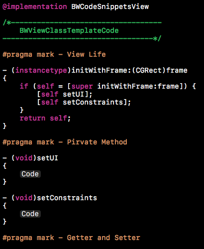
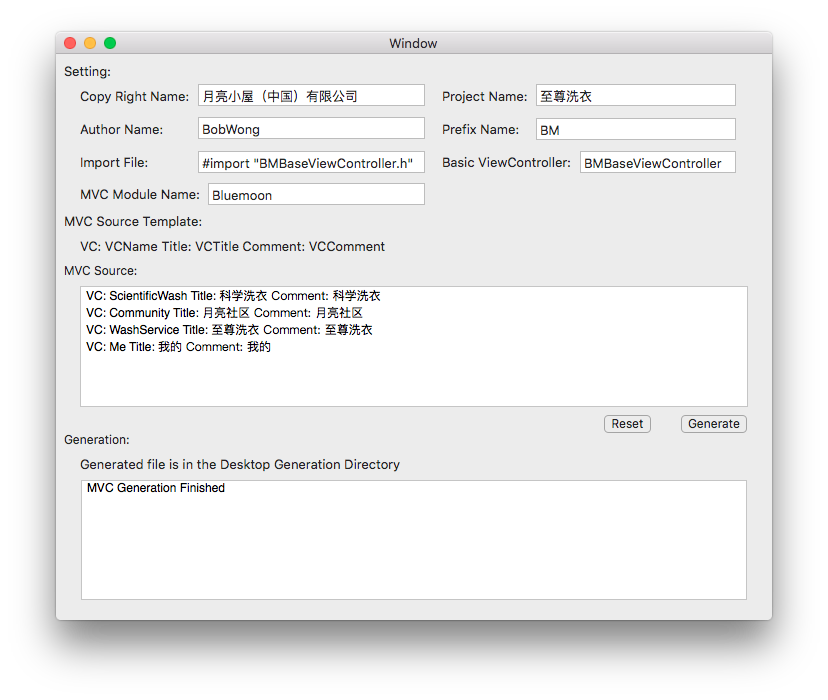
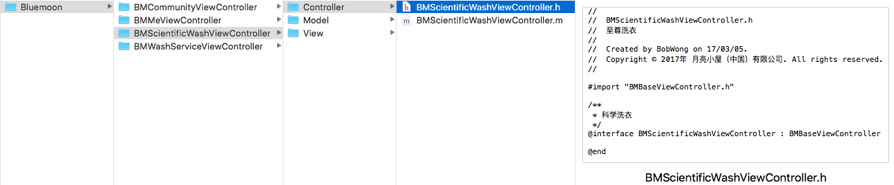

# BWEffectiveCoding
Effective Coding

高效编码的经验总结

## Contents

- Overview
- Software Design
- Macro Definition
- Code Snippets
- Code Generator
- Document
- Summary
- Reference
- Follow Me

## Overview

**软件设计**和**编码效率**是影响软件开发效率两个很重要的因素，在此主要讨论如何提升软件开发中的编码效率，减少重复性的编码，生成模板代码，把时间运用在更加有价值的地方。

由于有些编码效率的提升会以牺牲软件性能、增加代码量、降低项目可维护性为代价，所以需要平衡好这些代价和编码效率，不能过分依赖编码效率，而忽视软件本身的性能和项目的可维护性。

## Software Design

良好的软件设计是提升编码效率的基础，好的软件设计，可以减少重复性的编码，提升可维护性，如：面向对象编程中的设计思想，封装、继承、多态。

公共模块、工具类、工具代码。

在此对这一块不做讨论，主要讨论软件开发中的编码效率。

## Macro Definition

使用宏定义编写简洁的代码

### 数值和方法的宏定义

示例

```objective-c
#define SCREEN_WIDTH ([UIScreen mainScreen].bounds.size.width)
```

### 代码模板的宏定义

示例

网络请求实例Getter模板方法的宏定义

```objective-c
// 宏定义
#define BWAPIManagerGetterTemplate(class, apiManager) \
\
- (class *)apiManager {\
    if (!_##apiManager) {\
        _##apiManager = [class new];\
    }\
    return _##apiManager;\
}

// 运用
BWAPIManagerGetterTemplate(NSObject, apiManager0)
BWAPIManagerGetterTemplate(NSObject, apiManager1)
```

## Code Snippets

使用代码片段提升编码效率

### Xcode Code Snippets

Xcode面板位置：Utilities -> Code Snippets Library



Code Snippets存储路径：~/Library/Developer/Xcode/UserData/CodeSnippets/

说明：Each one is a plist file.

### 编写Code Snippets

步骤：选中编写好的代码片段 -> 长按拖动到Xcode代码片段面板 -> 定义自己的代码片段

Completion Shortcut：代码片段的简写，接下来在项目开发中使用此值来快速生成对应的代码片段

Platform、Language、Completion Scopes

示例




### Objective-C Template Code

属性定义

```objective-c
@property (strong, nonatomic) <#DataType#> *<#member#>;  ///< <#Comments#>
@property (assign, nonatomic) <#DataType#> <#member#>;  ///< <#Comments#>
@property (copy, nonatomic) <#ReturnType#>(^<#BlockName#>)(<#Parameters#>);  ///< <#Comments#>
@property (copy, nonatomic) <#BlockType#> <#block#>;  ///< <#Comments#>
```

可以快速地对对应属性的类型、参数名、备注进行填充



### UI Template Code

UI控件

```objective-c
// 以UIView为示例
UIView *<#view#> = [[UIView alloc] init];
<#view#>.backgroundColor = <#UIColor *#>;
[<#superview#> addSubview:<#view#>];
```

Masonry约束布局

```objective-c
// 示例
[<#view#> mas_makeConstraints:^(MASConstraintMaker *make) {
    make.left.mas_equalTo(<#CGFloat#>);
    make.right.mas_equalTo(<#CGFloat#>);
    make.top.mas_equalTo(<#CGFloat#>);
    make.bottom.mas_equalTo(<#CGFloat#>);
}];
[view mas_makeConstraints:^(MASConstraintMaker *make) {
    make.left.mas_equalTo(<#CGFloat#>);
    make.width.mas_equalTo(<#CGFloat#>);
    make.top.mas_equalTo(<#CGFloat#>);
    make.height.mas_equalTo(<#CGFloat#>);
}];
```

UI控件事件的代理

```objective-c
// UIActionSheet为例
- (void)actionSheet:(UIActionSheet *)actionSheet clickedButtonAtIndex:(NSInteger)buttonIndex {
    NSString *titleBtn = [actionSheet buttonTitleAtIndex:buttonIndex];
    
    if ([titleBtn isEqualToString:<#(nonnull NSString *)#>]) {
        <#statements#>
    }
    else if ([titleBtn isEqualToString:<#(nonnull NSString *)#>]) {
        <#statements#>
    }
}
```

### Class Template Code

ViewController



View



### Project Template Code

项目开发中常用到的功能代码模板，如网络请求，对请求数据进行解析，取消Loading的代码；上下拉刷新的代码；等等。

## Code Generator

制作开发工具——代码生成器

### Script

使用Python脚本来做生成器，通过截取自定义的数据格式，来快速生成模板代码，以下讲到的程序用到的就是脚本来处理的。

### Application

示例——MVC生成器





## Document

使用文档记录常用的开发代码

备份重要的开发代码

养成备份阶段性编写出来的代码的习惯

记录将被删除的开发代码，供需要还原时使用

## Summary

提升编码效率，减少没有必要的开发时间支出，把时间用在更有价值的事情上。

## Reference

JSONExport：https://github.com/Ahmed-Ali/JSONExport

## Follow Me

Github：https://github.com/bobwongs